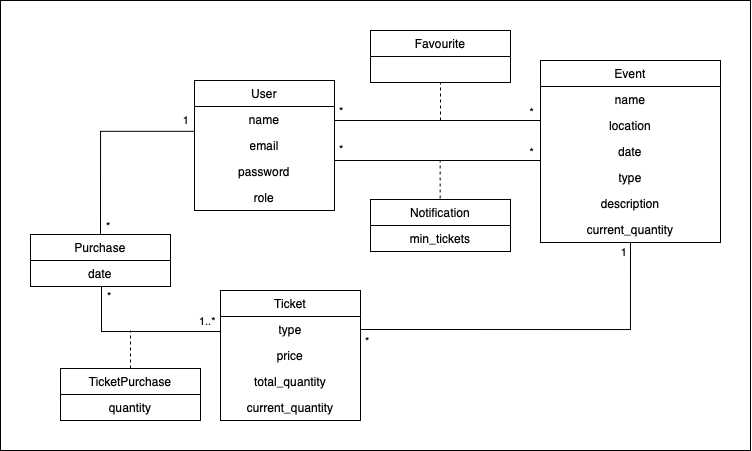

# ECTD Report

- Fábio Sá, up202007658@up.pt
- Inês Gaspar, up202007210@up.pt
- José Gaspar, up202008561@up.pt

## Abstract

The present report aims to explore, both theoretically and practically, the ETCD technology, a non-relational database using key-value paradigm.

Throughout the document, characteristics of the technology are presented, as well as its specificities and use cases. Next, a specific scenario is addressed, along with the strategies supporting the solution found. Finally, the implementation of the prototype using ETCD is explained, considering the aforementioned ideation, ETCD characteristics and some considerations of features in this paradigm.

## 1 - Introduction

O aumento da quantidade de dados levou à criação de novas soluções para tornar o armazenamento mais eficiente: bases de dados não relacionais.
Desta forma, surgiu o paradigma explorado neste relatório, key-value através da abordagem com a ETCD.

Este tipo de base de dados key-value tem um design muito simples e de aprendizagem rápida, uma vez que apenas depende do desenho da key e todo o processamento e manipulação necessária fica do lado da aplicação. Estas tecnologias de NoSQL permitem uma grande escalabilidade e melhor performance em relação às bases de dados relacionais.
A ETCD é uma base de dados frequentemente utilizada para configuração de sistemas de clusters. É especialmente usada por causa da forte consistência entre nós que permite, e que vai explorado nas próximas secções, assim através dos use cases desta tecnologia e do protótipo desenvolvido.

## 2 - Techonology

ETCD is a distributed key-value store. Key-value stores are a type of NoSQL database paradigm that stores data as a collection of key-value pairs, where each key is unique and associated with a single value.

This database system was initially developed by CoreOS in 2013, when it had its first release. In 2018, RedHat announced the acquisition of CoreOS, and IBM announced the acquisition of RedHat in the same year.

ETCD is free and follows an open-source licensing model. Its official documentation features many tutorials, demos, and installation instructions, as well as an extensive FAQ. The community is active and supportive, with user and developer forums on Google Groups, real-time updates on Twitter, and discussions on GitHub. Additionally, contributors and maintainers hold weekly online meetings via Zoom, with meeting documentation available and sessions archived on YouTube. As of the date of this report, it ranks 54th among the most used database engines and 5th in the key-value paradigm, according to the evaluation on db-engines.com.

The name "etcd" originated from two ideas: the unix "/etc" folder and "d"istributed systems. The "/etc" folder is a place to store configuration data for a single system, whereas etcd stores configuration information for large-scale distributed systems. Thus, it is widely used for configuration management, service discovery, and coordination in distributed systems.

ETCD provides a reliable way to store data across a cluster of machines and ensures strong consistency guarantees. Unlike most other NoSQL databases, ETCD is designed to be highly available and fault-tolerant, making it a popular choice for storing data in distributed systems. As specified by the CAP theorem (Consistency, Availability, Partition tolerance), in order to achieve strong consistency, ETCD sacrifices performance, which makes it not ideal for projects where execution time is crucial.

### 2.1 - Features

As it is going to be described throughout this section, ETCD has several features, some of them unique, that make this database a good choice in many distributed systems. As an example, ETCD is used in Kubernetes.

#### 2.2.1 - Replication and node communication features

This database works in a distributed way, that is, it's a cluster of machines (nodes). In etcd the number of nodes is always odd (1, 3, 5, etc). These nodes do not need to be physically together. Etcd basically stablishes connection between nodes via TLS. If the IP of the node is not known, etcd has a "discovery mode" that will find the node's IP address and establish the connection.
Even though it is possible to have multiple nodes in one cluster, etcd does not provide a way to support multiple clusters that can communicate with each other. To implement that feature, some communication protocol must be implemented between the clusters. One approach would be to put the leader node of each cluster in charge of that communication.
Each node has a copy of the data, and the data is replicated across the cluster. This means that, if a node fails, the data is still available on the other nodes.
In ETCD there is a total replication of the data.
ETCD is built on the Raft consensus algorithm to ensure data store consistency across all nodes in a cluster—table stakes for a fault-tolerant distributed system. This algorithm is based on quorums and as the name suggests it is used to have a consensus between all nodes about the values that are being stored in the database, taking into account that one or more nodes may fail. In etcd, for a cluster with n members, the quorum size is (n/2)+1. For any odd-sized cluster, adding one node will always increase the number of nodes necessary for quorum.
(https://www.ibm.com/topics/etcd)
(https://etcd.io/docs/v3.4/op-guide/clustering/)
(https://etcd.io/docs/v3.3/faq/)
(https://raft.github.io/)

#### 2.2.2 - Consistency features

ETCD provides sequential consistency, which is the stronger form of consistency that can be obtained in distributed systems. This means that, independently of the node of the cluster that receives the request from the client, it reads the same events in the same order.

Consistency is one of the advantages of using a distributed database. It allows for multiple nodes to be updated at the same time, which can lead to inconsistencies in the data. To avoid this, ETCD provides a quorum like strategy, which ensures that the data is consistent across all nodes in the cluster even if some nodes are down at that given moment.
(https://etcd.io/docs/v3.3/learning/api_guarantees/)

#### 2.2.3 - Watcher feature

ETCD provides a functionality called watcher. this watcher can be used to monitor a given key-value pair over time based on the operations executed over that key.
It can be especified if we want to monitor only the PUT, only the GET operations, or both, depending of the problem.

#### 2.2.4 - Data processing features

- For example, map-reduce support

Regarding data processing features, etcd does not provide much. As an example, functions like counts, sums, averages, map-reduces that are supported by other databases have no translation in etcd, making mandatory to process information after querying the database.
As it can be seen in the oficial documentation of etcd, the main features supported by etcd are methods to read, write and delete data, besides the ability to monitor changes in a given key-value pair plus the possibility of knowing the version of the key (version is required internally to achieve consistency in a distributed system) and seeing old values for a given key.

However, it is not only in data processing features that etcd is not ideal, also on the data types that can be stored in etcd. These types consist in strings and numbers, so there are no lists, sets or more complex data types.
To bypass this limitation, one possible approach (implemented on the demo that is going to be described later on this report) is to use functions like ".json()" and ".stringify()". With those functions we can transform a list or any other data type into a string, and then store it in etcd.

( https://etcd.io/docs/v3.6/dev-guide/interacting_v3/ )

### 2.3 - Data Model

The data model can be seen in a logical and physical way. Throughout this section both of them are going to be described shortly.

#### 2.3.1 - Logical View

The store's logical view is a flat binary key space with a lexically sorted index for efficient range queries. It maintains multiple revisions, with each atomic mutative operation creating a new revision. Old versions of keys remain accessible through previous revisions, and revisions are indexed for efficient ranging. Revisions are monotonically increasing over time.

A key's life spans a generation from creation to deletion, with each key having one or multiple generations. Creating a key increments its version, starting at 1 if it doesn't exist. Deleting a key generates a tombstone, resetting its version to 0. Each modification increments a key's version within its generation. Compaction removes old generations and values except the latest one.

#### 2.3.2 - Physiscal View

etcd stores data in a persistent B+tree, with each revision containing only the delta from the previous one for efficiency. Keys are represented as 3-tuples (major, sub, type), allowing differentiation and optional special values like tombstones. The B+tree is ordered lexically for fast ranged lookups over revision deltas. Compaction removes outdated key-value pairs. Additionally, etcd maintains an in-memory Btree index for speedy range queries, with keys exposed to users and pointers to modifications in the persistent B+tree.

(https://etcd.io/docs/v3.3/learning/data_model/)

### 2.4 - Supported Data Operations

ETCD provides an HTTP/JSON API that allows clients to perform CRUD operations on the data store. The API is designed to be simple and intuitive, and it is easy to use.
There are mainly 2 operations, GET and PUT. As the names sugest, these operations are used to retrieve a given value based on a key and store a new / existent key-value pair, respectively.
Still talking about the GET operation, it is possible to specify a range of keys, and the response will be a list of key-value pairs. This range of keys can only be specified by prefix. To exemplify, if the keys app:foo and app:bar exist, the prefix app: can be used to retrieve both keys and their respective values.
Regarding updates, they are just a new PUT, over the same key.
It is also possible to delete key-value pairs using the delete operation.
Regarding the watchers, via the API, it is possible to create them and generate a function that is going to run at each operation over the key that is being watched / monitored.

(https://github.com/microsoft/etcd3/blob/master/src/test)

### 2.5 - Use Cases

### 2.6 - Problematic Scenarios

As previously discussed, the lack of data processing features is a problematic scenario in etcd. It is not possible to perform complex operations on the data, like aggregations, joins, etc. and require pos-processing of data, making these operations less efficient.
Besides this, etcd allows to search keys by prefix however they do not allow to do it by suffix. This adds some constraints to the aggregates' creation. As an example we could easily get the amount of tickets available using the aggregate:
ticket:<event>:<ticket_type> : {
    current_quantity: int64,
    ...
}

because we can search for all keys that start with ticket:<event> and then sum the results (the current_quantity field) but we could not get the quantity of available tickets of a given type. If sufix search was implemented we could do it more efficiently.
Another problematic scenario is related with the restricted data types that can be stored in the database (numbers and strings). Since we need to keep a json encoded as string when more complex types are required, this makes attribute search impossible, so if I want to know only a given field, I have to recieve the entire entity and then select the attribute manually.

Etcd was developed to deal with small key-value pairs, typically designed to metadata. Hence, the maximum size of any request is 1.5 MiB. Similarly, the suggested maximum size of the database is 8 GiB (2 GiB is the default). With that said, we can conclude that this database was not built to be used as a cache, as it is not designed to store large amounts of data.

Fast disks are vital for etcd performance and stability. Slow disks increase request latency and cluster instability. Etcd's consensus protocol requires timely storage of metadata to a log, with most cluster members writing every request to disk. Etcd also checkpoints its state to disk for log truncation, and delays in these writes can cause heartbeat timeouts, triggering cluster elections and instability. Etcd is highly sensitive to disk write latency, needing at least 50 sequential IOPS (e.g., from a 7200 RPM disk) and ideally 500 sequential IOPS (e.g., from a local SSD or high-performance virtualized block device) for heavily loaded clusters. This limitation, together with the inability of writting a block of key-value pairs in one operation - would eventually surpass the 1.5MiB of request - makes the entire cluster slower when facing lots of consecutive writes. This drawback is noticeable when populating an etcd database for example.

Furthermore, etcd can also become problematic due to its own nature of replicating data totally. Yes, it is possible to have several nodes running to ensure data is (almost) never lost, however this makes the entire system slower with the increase of nodes, precisely due to data consistency and replication.

( https://etcd.io/docs/v3.4/dev-guide/limit/ )
( https://etcd.io/docs/v3.3/op-guide/hardware/ )

### 2.7 - ETCD vs. Other Solutions

- advantages and drawbacks noutras key-value solutions

As previously mentioned, ETCD is not like most key-value databases. It is recommended to be used when sequential consistency is needed, in distributed systems, and not to be used as a cache, like Redis, for example. There is a tradeoff between having a fast response time and having a consistent state. ETCD is made not to be fast but consistent while most key-value databases are made to be fast but not consistent.
The main advantage of ETCD is the ability of having more than one point of failure. Thanks to the leader election algorithms and the Raft consensus algorithm, if more than 50% of the nodes are up and running, the system will be able to continue working and accept new operations over the database. Then, when the nodes that fail recover, the state is fully replicated to those nodes achieving the sequential consistency that is needed and guaranteed by the API.
Other advantage, as specified in ETCD documentation, the maximum reliable database size of ETCD is of several gigabytes while others (e.g ZooKeeper and Consul) can support until hundreds of megabytes.
The main drawback is the performance of ETCD and the lack of ability of inserting larges amount of data in a block. Operations on database are restrict to one at a time.

## 3 - Prototype

To validate the main features, qualities, and potential bottlenecks of the mentioned ETCD technology, a prototype — proof of concept based on this key-value paradigm — was developed and presented in the following sections.

### 3.1 - Topic

In a classic scenario of purchasing tickets for events, data consistency is the most important aspect to consider. For example, each event should display its updated information in real-time, including the number of remaining tickets, regardless of the number of simultaneous purchases occurring. A failure in data replication and propagation within the system can result in event overbooking, inaccurately computed purchases, and potential revenue loss.

To ensure the system is immune to such issues, it is necessary to rely on a database that is simultaneously:

- Distributed, for horizontal scalability ensuring the system can handle the growing workload effectively;
- Fully-replicated, where every data read returns the latest data write across all clusters and nodes, something that is not achievable with eventual consistency;
- Highly available, to have no single point of failure and gracefully tolerate hardware failures and network partitions.

TickETCD, a web application for purchasing tickets for events, uses ETCD as a solution to the aforementioned problems. The implementation details will be described in the following subsections.

### 3.2 - Conceptual Data Model

In order to meet the needs of the application, the following relationships have been designed, as shown in figure [F1]:



An event has a name, location, date, type, a description, and a total quantity of available tickets. Each event may offer various ticket types, each associated with a price, as well as their initial and current total quantity. Users, identified by their name, email, password, and role, can have favorite events and request notifications when the quantity of tickets for a specific event reaches a certain limit. Additionally, users can purchase various types of tickets.

### 3.3 - Physical Data Model and Data Structures

The previous Conceptual Data Model could be implemented physically using relational database schemas, allowing for direct searches for relationships between entities. However, in the case of dealing with the key-value paradigm used in ETCD, it was necessary to resort to data redundancy to ensure complete knowledge of all relationships and still minimize the number of post-processing steps.

Below are presented the key and value structures used for the design of the entire data structure required by TickETCD. It should be noted that for the purpose of data visualization and manipulation, JSON was used, although physically, they are just strings, as ETCD does not support other data types as values for its keys, as described in the previous sections.

#### 3.3.1 - User

Without any post-processing, it is possible to query all information related to a user by querying the key in the format `user:<USERNAME>`. Example:

```json
"user:johndoe": { 
    "name": "jonh doe", 
    "email": "john@mail.com", 
    "password": "john123", 
    "role": "admin"
}
```

#### 3.3.2 - Event

Similarly to a user, the information about an event can be accessed by a simple query using the key `event:<ID>`. Example:

```json
"event:92fe965d-a189-4f26-844c-0979c6ca035e": {
    "name": "Simple concert", 
    "description": "A simple event example", 
    "location": "porto",
    "type": "concert",
    "date": "2024-03-13",
    "current_quantity": "14",
}
```

#### 3.3.3 - Ticket

Given an event and a ticket type, it is possible to determine their current characteristics by using the key in the format `ticket:<EVENT_ID>:<TYPE>`. Example:

```json
"ticket:92fe965d-a189-4f26-844c-0979c6ca035e:pink": {
    "total_quantity": "34", 
    "current_quantity": "23", 
    "price": "23.99",
}
```

The ticket type is the same and fixed for all events, so there would be no issue in declaring this key in the format `ticket:<TYPE>:<EVENT_ID>`. The ticket types are included in the static auxiliary structures to be explored later.

#### 3.3.4 - Notification

Given that a user can activate a notification for a specific event, the structure `notification:<USERNAME>:<EVENT_ID>` was used to store this data:

```json
"notification:johndoe:92fe965d-a189-4f26-844c-0979c6ca035e" : {
    "limit": 42,
    "active": true,
},
```

As defined, and leveraging ETCD's feature of searching by key prefix, the system also has direct access to all notifications for a user by searching only for prefix `notification:<USERNAME>`. This way post-processing was avoided.

#### 3.3.5 - Favourite

With the key in the format `favorite:<USERNAME>`, a single operation is sufficient to ensure the retrieval of all events marked as favorites by the user:

```json
"favourite:johndoe": [
    "92fe965d-a189-4f26-844c-0979c6ca035e",
    "ad25c85c-6714-4d1f-857b-9bcd1a45ccb9"
]
```

#### 3.3.6 - Purchase

Due to potential key collisions in a distributed context, indexing keys by timestamp became unfeasible. Therefore, the purchase history of a user for an event can be queried using the key `purchase:<USERNAME>:<EVENT_ID>`. Example:

```json
"purchase:johndoe:ad25c85c-6714-4d1f-857b-9bcd1a45ccb9": [
    {
        "date": "2024-03-14 13:45:00",
        "tickets": [
            {
                 "type": "red",
                "quantity": "3"
            },
            {
                "type": "green",
                "quantity": "42"
            }
        ]
    }
]
```

A purchase is characterized by an array of transactions, each containing a timestamp and a list of purchased tickets. Since the event ID is already present in the key, redundancy was avoided by not including the event identification again here, as it already contains these tickets.

Just like in the case of notifications, leveraging ETCD's feature of searching by key prefix, the system also has direct access to all user purchases by searching only for the prefix `purchase:<USERNAME>`, without requiring post-processing.

#### 3.3.7 - Search

One of the features to explore in TickETCD is the search for events by string, type, and location. Since ETCD, being a key-value database, does not allow searching by values but only by keys, an inverted index was implemented:

```json
"search:text:some": [
    "92fe965d-a189-4f26-844c-0979c6ca035e",
    "ad25c85c-6714-4d1f-857b-9bcd1a45ccb9"
],

"search:type:concert": [
    "f2af5c43-7cad-49f8-88c1-2ff7e8fe8d81"
],

"search:location:lisbon": [
    "97636456-a096-4868-9dc1-aac79a22961c",
    "f2af5c43-7cad-49f8-88c1-2ff7e8fe8d81",
    "c78f3b62-9fc9-4f05-9651-61354d720edc"
]
```

As observed, the key is constructed based on the search type followed by the input, in the format `search:<SEARCH_TYPE>:<INPUT>`. Its value is always a list of events that owns these characteristics. This also requires initial processing and runtime processing of the strings that constitute the event, such as the name and description, something to emphasize in the limitations of this implementation.

The text search leverages ETCD's prefix search feature, allowing users to search not only for a single word but also for the prefix of that word and obtain the same results without additional computational cost.

#### 3.3.8 - Static data

To ensure and enforce system constraints, some static auxiliary structures have been added to the database. Examples:

```json
"event:locations": ["lisbon", "porto", "braga"],

"event:types": ["concert", "theater", "dance", "magic", "circus"],

"ticket:types": ["pink", "blue", "green", "red"],
```

Event locations, event types, and ticket types are frequently accessed structures, allowing for rapid data selection without the need for complex queries or additional post-processing. However, this adds more redundancy to the system.

### 3.4 - Architecture

Auxiliados com makefile para cada um dos sub-steps
arquitetura, flow diagram, incluindo configs e python, cluster e tal

Falar da biblioteca Faker, ficheiros de configuração, docker, cluster, server with node and tailwind, biblitoeca ECTD3 da Microsoft.

Passos auxiliados e automatizados com o provided makefile, falar disso no fim desta secção

### 3.5 - Features

#### 3.5.1 - Data processing

#### 3.5.2 - Queries

#### 3.5.3 - Specific Features

- prefix (na realidade é getAll() mas que não tem custo grande por é de replicação total, logo dá para fazer isto)
- notifications (como o etcd é )
- cluster/node saúde

#### 3.5.4 - Limitations

- Redundância excessiva, para combater as relações que poderiam simplesmente serem usadas em modo relacional
- Povoação não-em-bloco, explicar o processo de ser lento. explicar também que devido à redundância isto explode em exponencial, indexação do search e tal 
- Transactions limitadas ou inexistentes. Casos onde o protótipo se dá mal
- Pesquisa sem queries complexas (por timeline, por número de bilhetes..., por atributos no fundo). A função
- Updates de data structures, como da pesquisa;
- JSON.stringigy / JSON.parse, para values, torna ineficiente quando comparado com outras soluções como redis

## 4. Conclusion

## References

-
-
-
-
-

## Annexes

- 
- 
- 
- 
- 